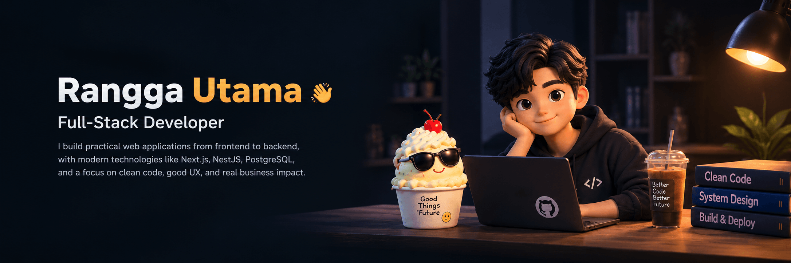

 

**Building practical web applications for real-world business problems.**

 

  

---

## About Me

I build business-oriented web applications, and I care most about **business logic, data integrity, and system architecture**, not only the interface.

Currently focused on:

- Full-stack web development with TypeScript
- Backend architecture and REST APIs
- Business process applications (inventory, POS, cost management)
- Portfolio projects built around real use cases

---

## Featured Projects

| Project                                        | Description                                                                                                                        | Stack                                   |
| ---------------------------------------------- | ---------------------------------------------------------------------------------------------------------------------------------- | --------------------------------------- |
| **[DapurHPP](GANTI_LINK_REPO_DAPURHPP)**       | Management app for a home-based food business: HPP (cost of goods), production costs, inventory, sales, expenses, and profit/loss. | Next.js · NestJS · Prisma · MySQL       |
| **[SCOPREVO](GANTI_LINK_REPO_SCOPREVO)**       | AI-powered scope and revision management platform for freelancers and agencies to manage client feedback and revision boundaries.  | Vue · Express · TypeScript · PostgreSQL |
| **[Toko Emas POS](GANTI_LINK_REPO_TOKO_EMAS)** | Interactive POS/ERP prototype for a gold store: sales, buyback, inventory, gold pricing, reporting, and hardware simulation.       | Next.js · NestJS · Prisma · PostgreSQL  |

<!-- TODO: tambahkan link demo/screenshot per project, contoh:
[Live demo](LINK) · [Screenshot](./asset/dapurhpp.png)
-->

---

## Tech Stack

**Languages & Frameworks**

  
  
  
  
  
  
  

**Database & Backend**

  
  
  
  

**Tools**

  
  
  
  

---

## GitHub Activity

---

## Contribution Game

---

## Open To

- Junior / entry-level full-stack developer roles
- Remote software development opportunities
- Freelance web development projects

---

### Let's build something useful.

[Portfolio](GANTI_LINK_PORTFOLIO) · [LinkedIn](https://linkedin.com/in/rangga-utama-6bb76b362/) · [Email](mailto:ranggau727@gmail.com)

